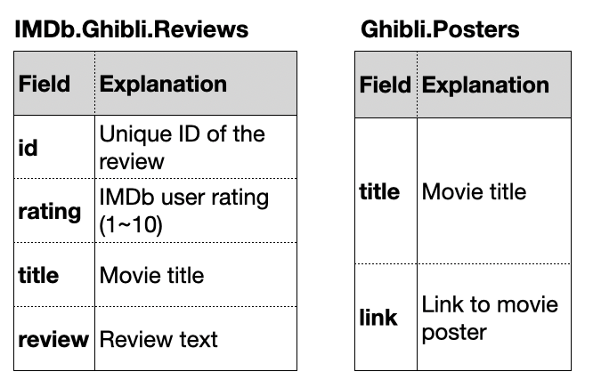
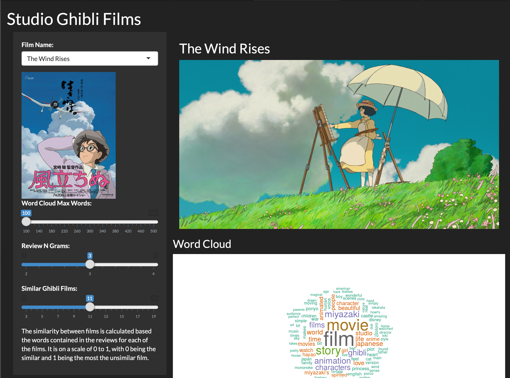

# Ghibli R Web App

## Introduction
This application is built around the concept "Who has the time to read all the IMDb reviews?". This application aims to promote the wonderful films made by the Ghibli animation studio by condensing the reviews information on the IMDb website and obtaining the images and trailers about the selected movies automatically.

First the film titles and basic information are obtained using the Ghibli API. Using this information reviews were scraped from the IMDb movie reviews website. Some basic NLP techniques such as word clouds and N grams were used to summarise about 1500 user reviews. Also, the similarity between films was calculated based on the words within the reviews. Finally, the YouTube Data API was used to find the appropriate trailer for the movie automatically. 

## Deployment
**Shiny App IO**: 
https://tigerstone.shinyapps.io/project/

## APIs Used
### Youtube Data API

https://developers.google.com/youtube/v3

Used to obtian movie trailers. Refer to `YouTube.R` for code.

### Ghibli API 

https://ghibliapi.herokuapp.com

Use to obtain movie titles and related information such as directors and producers. Refer to `ghibliPortal.R` for code.

## Scraping
### IMDb Website

https://www.imdb.com

User Review data was scraped from the IMDb website and stored in the `IMDB.Ghibli.Reviews` table on the cloud SQL database. Refer to `IMDbPortal.R` for source code.

### Studio Ghibli Official Website

http://www.ghibli.jp/works/

The links to the posters for the movies were obtained from the official studio ghibli website. They are stored in the table named `Ghibli.Poster` on the cloud SQL database. Refer to `ghibliPortal.R` for source code.

## Database
### Google Cloud Postgre SQL Database

The data is stored on a google cloud SQL database. The database contains two basic tables as shown above. They are collected from the database and loaded in the local environment when the app starts. The database is updated automatically at 0:00 a.m. on the first day of every month via CRON job. Refer to `cron.R` and `cron.yaml` for code.

## Improvements
* Better UI design (for sure).
* Functions for obtaining YouTube trailer statistics and comments are implemented but not utilized.
* Obtaining more movie data and utilizing advanced NLP techniques.

## Screen Shot
